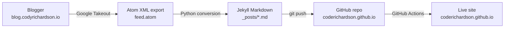
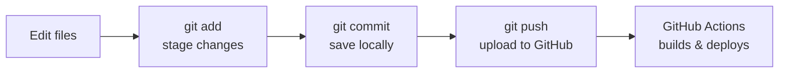

If you're reading this, it's running on a completely different platform than it was a few weeks ago. This blog spent its entire life on Blogger -- from the first post back in September 2019 right up through early 2026. It served me well, but I'd been wanting to own more of the stack for a while. This post is the story of that migration: why I did it, how it works, and -- more honestly -- all the things that broke along the way and how I fixed them.

This is a long one. I wanted to document the whole process end-to-end, partly so I remember what I did, and partly in case anyone else is staring down the same migration and wants to know what they're getting into. Grab a coffee.

Editor's note: this entire post was written by Claude Code. It is the only post in my blog to date that is written by Claude or any other AI/LLM for that matter. Generally speaking, I see litle point in having AI write for me. Enjoying the writing process is part of why I blog. However, this time, I almost felt I owed it to Claude to take a pass at writing the post. It had done most of the heavy lifting getting my blog migrated over. And after reading through its post, I realized it had done a pretty good job summarizing everything that was accomplished. Sure, it screams "written by AI", but I don't plan on this becoming a regular thing. 

Anyway, Claude saved me what would probably have been weeks of work and did it in collectively 2-3 hours with me taking minor manual interventions from time to time. Also, I realize it claims a few times "infrastructure I control end to end" -- I have zero control over GitHub. But for right now, I do prefer this to being dependent upon Blogger for multiple reasons. I hope you do too. Enjoy!

## Why Leave Blogger?

Blogger is fine. It's free, it's reliable, and it handled hosting, image storage, and rendering without me having to think about any of it. So why move?

A few reasons:

1. **Control.** On Blogger, my content lived in Google's database in Google's format on Google's infrastructure. I wanted my posts to be plain files I own, in a format (Markdown) that will still be readable in twenty years.
2. **Version control.** I'm far more comfortable editing Markdown in an editor and committing to git than I am wrestling with a WYSIWYG editor in a browser tab.
3. **Portability.** Once the content is Markdown in a git repo, moving it *again* later (if I ever need to) is trivial. I'm not locked in.
4. **The domain.** I want `codyrichardson.io` pointing at infrastructure I control end to end.

The target: a [GitHub Pages](https://pages.github.com/) site built with [Jekyll](https://jekyllrb.com/) and the [Chirpy theme](https://github.com/cotes2020/jekyll-theme-chirpy). GitHub Pages is free, backed by a CDN, and builds automatically from a git repo. Jekyll is the static site generator GitHub Pages natively supports. Chirpy is a clean, technical-blog-oriented theme with good defaults.

Here's the high-level picture of where we started and where we ended up:



The rest of this post walks through each arrow on that diagram -- and the parts that didn't go to plan.

## Phase 1: Standing Up GitHub Pages

The foundation was the [Chirpy starter](https://github.com/cotes2020/chirpy-starter), which is a minimal scaffold that pulls the theme in as a gem rather than forking the whole theme repo. That keeps the repo clean -- you only have your content and config, not thousands of theme files you didn't write.

The repo is named `coderichardson.github.io`. That specific naming convention matters: when a GitHub repo is named `<username>.github.io`, GitHub Pages serves it at exactly that domain automatically.

Deployment is handled by **GitHub Actions**. Every time I push to the `main` branch, an Action runs Jekyll, builds the static site, and publishes it. I don't run a build step manually -- I just push Markdown and the site updates within a minute or two.

One workflow tweak worth noting: the default Chirpy build includes an `htmlproofer` test step that validates every link and image. It was failing the build on external links that were perfectly fine (sites that block automated requests, the usual). Since a broken external link shouldn't block my entire site from deploying, that test step was removed from the workflow. I also added a small touch where the build writes the deploying commit's SHA into a data file, and the footer renders it as a linked hash -- so I can always tell exactly which commit produced the live site.

### Phase 2: Making It Mine

A theme out of the box is a theme. Personalization included:

- An avatar image
- A real **About** page
- Social links (GitHub, Twitter/X, LinkedIn, email, RSS)
- Navigation cleanup

The navigation cleanup had one genuinely non-obvious gotcha worth recording. Chirpy's sidebar tab **labels** don't come from the page files you'd expect -- they come from a localization file (`_data/locales/en.yml`). I wanted the "Tags" tab to read "Categories." Editing the page's frontmatter title did nothing; the fix was overriding the label in the locales file. If you ever find yourself renaming a Chirpy tab and the label won't budge, that's where to look.

## Backing Up Blogger -- The Source of Truth

Before converting anything, I needed the content out of Blogger in a usable form. Blogger doesn't have a fancy export wizard, but Google Takeout does the job. Takeout produces an **Atom XML feed** -- a single `feed.atom` file containing every post: title, full HTML body, publish date, labels (tags), and Blogger's internal metadata.

This file became the single source of truth for the entire migration. Critically, **I never edited it.** Every script read from it; nothing wrote back to it. When something went wrong downstream (and things went wrong), I could always go back to this pristine export and re-derive the correct content. If you take one thing from this post: keep your raw export immutable and treat everything else as reproducible from it.

A trimmed example of what a single post looks like inside that Atom file:

```xml
<entry>
  <id>tag:blogger.com,1999:blog-...post-...</id>
  <blogger:type>POST</blogger:type>
  <blogger:status>LIVE</blogger:status>
  <title>Account Security - Making a Secure Password</title>
  <content type="html"> ...full HTML body... </content>
  <published>2019-11-09T19:43:00.001Z</published>
  <category term="Passwords" />
  <blogger:filename>/2019/11/account-security-psa.html</blogger:filename>
</entry>
```

Two fields there earn their keep:

- `blogger:type` and `blogger:status` -- the feed contains drafts, pages, and trashed items too. Only entries that are `POST` **and** `LIVE` should become published posts.
- `blogger:filename` -- this preserves the original URL path. Reusing it as the slug means old Blogger links keep the same final path component, which matters for not breaking the web.

## Converting Atom to Jekyll Markdown

Jekyll expects one Markdown file per post in a `_posts/` directory, named `YYYY-MM-DD-slug.md`, with a YAML "frontmatter" block at the top. So the conversion job was: parse the Atom XML, and for every live post, emit a correctly named Markdown file with the right frontmatter and a Markdown body converted from the original HTML.

I wrote a Python script for this using the standard library's `xml.etree.ElementTree` for parsing and the `markdownify` library for HTML-to-Markdown conversion. The shape of each output file:

```markdown
---
title: "Account Security - Making a Secure Password"
date: 2019-11-09 19:43:00 +0000
tags:
  - "Passwords"
  - "Authentication"
---

Post body in Markdown...
```

The frontmatter is the metadata Jekyll uses: the `title` shows as the post heading, the `date` controls ordering and the Archives page, and `tags` drive the tag/category pages. The filename's date prefix and slug together produce the final URL.

This part went smoothly for the bulk of the content. Twenty-nine posts spanning September 2019 to April 2026 converted, landed in `_posts/`, got committed, and pushed. GitHub Actions built the site. Posts were live with their original dates intact.

And then I started actually reading the posts.

## Trouble, Part 1: The Disappearing Images

Several posts were missing images. Not all images -- specifically, **captioned** images. Where a post should have shown a screenshot with a caption underneath, instead there was an empty box and some stray caption text floating on its own.

The root cause was a mismatch between how Blogger structured captioned images and how the HTML-to-Markdown converter handled them. Blogger wraps a captioned image in an HTML table:

```html
<table class="tr-caption-container">
  <tbody>
    <tr><td><a href="full.jpg"></a></td></tr>
    <tr><td class="tr-caption">My caption text</td></tr>
  </tbody>
</table>
```

The converter saw a `<table>` and dutifully produced a Markdown table. But Markdown tables can't contain images the way HTML table cells can, so the `` got dropped entirely. What survived was an empty table skeleton with only the caption text in the last cell:

```
|  |
| --- |
|  |
| My caption text |
```

Every one of those was a missing image. The caption text was the breadcrumb -- it told me *which* image belonged there.

The fix was a second script that went back to the immutable Atom export, parsed the original HTML with a real HTML parser (not a Markdown converter), specifically hunted for `<table class="tr-caption-container">` elements, and pulled the `` and caption out of each one. Then it matched those captions against the empty-table placeholders in the Markdown and replaced them with proper Markdown image syntax plus an italicized caption.

This recovered 16 images across 5 posts on the first pass. (It would turn out there were more hiding in formats this pass didn't catch yet -- more on that later.)

### A Python Gotcha Worth Its Own Paragraph

This image-fix script appeared completely broken on first run. It reported "no content" for posts that very obviously had content. The bug is a classic Python `ElementTree` trap and it's worth burning into memory:

```python
content_el = entry.find("atom:content", ns)
if not content_el:        # WRONG -- always falsy for childless elements
    skip()
```

An `ElementTree` element with **no child elements** evaluates as falsy in a boolean context -- even when the element exists and is packed with text. The Atom `<content>` element holds a giant string of HTML but no child *elements*, so `not content_el` was `True` and every post got skipped. The correct check is explicit:

```python
if content_el is None:    # RIGHT
    skip()
```

If you parse XML in Python, internalize this now and save yourself the afternoon I spent on it.

## Trouble, Part 2: Tags

Some posts had come over from Blogger with no labels at all, which meant no tags, which meant they were nearly invisible in the new site's navigation. The rule I settled on: **no post may have zero tags.** Every post got reviewed and tagged appropriately, with new tag blocks inserted into the frontmatter of posts that had none.

One specific change: my post about atomic clocks and time had been tagged generically as "Networking." That undersells it, so it got retagged with "NTP" and "Time" instead -- more accurate, and it groups sensibly with related content.

## Trouble, Part 3: The Images Were Still Google's

Here's a subtle one. Even after fixing the *missing* images, every image that *was* showing had a `src` pointing at `blogger.googleusercontent.com` -- Google's CDN. The images displayed fine, but my self-contained blog was quietly still depending on Blogger infrastructure for every screenshot. If Google ever ages those URLs out, the posts rot. That's exactly the kind of dependency this whole migration was supposed to kill.

So the next job: download every image from Blogger's CDN and re-host it inside the repo, then rewrite every image reference to point at the local copy.

The convention: images for a post live in `assets/img/posts/<slug>/` and are referenced with an absolute path:

```markdown

```

GitHub Pages has generous limits for this -- a soft 1 GB repo size, 100 GB/month bandwidth, 100 MB per file. The entire image set for this blog is a tiny fraction of that, so hosting images in-repo is well within bounds.

### The Sizing Decision

A test migration of one image-heavy post (running Ethernet through my house -- lots of phone photos) surfaced a real question. Those phone photos are **4032 pixels** wide. Migrating that one post at full resolution pulled down **8.8 MB** of images. Scale that across every photo-heavy post and the repo balloons fast -- not fatally, but wastefully.

There were three options on the table:

| Option | Approach | Pro | Con |
|---|---|---|---|
| A | Keep full resolution as-is | Maximum quality | Huge files; 4032px is absurd for a blog |
| B | Cap width at download time | Big size savings, no visible quality loss | Slightly more script logic |
| C | CSS `max-width` only | Zero file changes | Files stay huge; bandwidth still wasted |

The key realization: the theme's CSS already constrains how wide an image *displays* in a post. A 4032px image and a 1600px image look **identical** on the page -- the only difference is how many bytes got shipped to render the same pixels. Option C fixes nothing because the giant file still travels. Option A is just wasteful. Option B wins.

Re-running that same Ethernet post with a 1600px cap brought 8.8 MB down to **3.84 MB** -- less than half -- with zero perceptible difference on the page.

The cap is deliberately conservative. Blogger CDN URLs encode the requested image size as a token in the path (e.g. `/s4032/`). The migration only rewrites that token *down* when it exceeds 1600px:

```python
def cap_blogger_url(url, max_width=1600):
    """Downsize only oversized images; leave small ones untouched."""
    def replace(m):
        if int(m.group(1)) > max_width:
            return f"/w{max_width}/"
        return m.group(0)   # already small enough -- don't touch it
    return re.sub(r"/s(\d+)/", replace, url)
```

This matters: the goal was never "shrink all images." Screenshots and diagrams are usually already small and *should not* be degraded -- downscaling a 600px diagram just makes it blurry for no benefit. The rule is simply "don't ship anything wider than 1600px," which only ever touches oversized photos.

**If I want to run this again in the future:** the cap lives in one constant (`max_width=1600`). Bump it for sharper photos at the cost of size, lower it to be more aggressive. For brand-new images I create myself (not from Blogger), the script doesn't apply -- I just resize before committing. A 4032px phone photo resaved at 1600px wide drops from multiple MB to a few hundred KB with no visible loss on a blog; screenshots can usually go up as-is.

### Migrating Everything, Safely

With the strategy settled, the full run had to handle ~23 remaining posts. The principles I held to:

- **Back up every post before touching it.** A copy of each post's pre-migration Markdown went to a backups directory. If any single post got mangled, I could restore *just that one* without unwinding the whole project.
- **One git commit per post.** Not one giant commit. Per-post commits mean per-post rollback -- if post #14 has a problem, `git revert` on that one commit fixes it and leaves the other 22 untouched. Granularity is cheap insurance.
- **Skip posts with nothing to do.** Text-only posts were detected and left alone.

The migration regex that found and rewrote image references earned its complexity. Two real-world cases forced it:

1. **Linked thumbnails.** Blogger commonly emits `[](full-res-url)` -- a small clickable image linking to the full-size one. The script downloads the **full-res** target, then collapses the whole thing to a single un-linked local image.
2. **Parentheses in filenames.** One image was a screenshot whose filename literally contained `(6-Piece)`. A naive URL-matching pattern stops dead at the first `)`, capturing a truncated, broken URL. The pattern had to use non-greedy matching anchored to the structural delimiters of the Markdown image syntax so it expands *past* parentheses inside the URL and only stops at the real boundary. Small detail, corrupted a post until it was right.

The bulk run worked. Twenty-three posts, twenty-three commits, every image local. One image returned an HTTP 400 from Blogger's CDN during download -- and that turned out to be the thread that unraveled a whole category of remaining bugs.

## Trouble, Part 4: The Long Tail of Edge Cases

That single 400 error wasn't a dead image on Google's side. It was the migration regex mishandling a post where **two linked images sat concatenated on a single line** with no separator. The pattern assumed one image per line; given two, it captured a Frankenstein URL spanning both and the download failed. The images themselves were fine -- the *parser* wasn't.

That prompted a full manual review of all 29 live posts, reading each one as it actually rendered. The review turned up **nine more images** across **six posts** that the automated pass had missed -- each for a different, instructive reason:

| Post | Why the automation missed it |
|---|---|
| Account security | Two linked images concatenated on one line |
| Account security | Two captioned-table images never restored ("worst passwords", XKCD) |
| SPF / DKIM / DMARC | Image indented inside a numbered list (pattern anchored at column 0) |
| Automating TLS renewal | Image wrapped in `**bold**` markdown |
| Certificate formats | Image embedded in a malformed table cell |
| AWS security groups | Two captioned-table images never restored |
| Procmon | Two captioned-table images never restored |
| What happens when you type a URL | Captioned-table diagram never restored |
| Compliance overview | Captioned-table image; caption hid a literal non-breaking space |

That last one deserves a callout because it's the kind of bug that makes you question your sanity. The automated text replacement for one caption kept failing even though the text looked *identical* on screen. It wasn't. The caption contained a literal **non-breaking space** (Unicode `\xa0`) where a normal space appeared to be. Visually indistinguishable; byte-for-byte different. The string match failed until the replacement explicitly accounted for that character. If you ever have a "but it's RIGHT THERE" find-and-replace failure on content that came from a CMS, suspect invisible Unicode early.

Every one of these was fixed, committed individually, and pushed. After this pass: all 29 posts, every image, fully self-hosted. Zero `blogger.googleusercontent.com` references anywhere in the content.

## The Git Mental Model (For Anyone New to This)

One thing crystallized over the course of this project and is worth stating plainly, because it trips up everyone at first: **`git commit` and `git push` are two different actions.**



- **Commit** records a snapshot in your *local* repository. Nothing leaves your machine. You can commit on a plane.
- **Push** uploads your local commits to the *remote* (GitHub). Only now does anything become visible to GitHub -- and only now does the site rebuild.

This separation is exactly why the per-post-commit strategy was safe: I could make 23 local commits, review the whole thing, and only then push them as a batch. The commit history stays granular for rollback, but nothing went live until I deliberately sent it.

## What I'd Tell Someone Doing This

If you're migrating off a hosted blog platform, here's the distilled advice:

1. **Treat your raw export as immutable.** Every later artifact should be reproducible from it. You *will* need to go back to it.
2. **Automate the bulk, hand-finish the tail.** A script converted 29 posts in seconds. But roughly a dozen images needed individual human attention because real content is messier than your regex. Budget for both phases.
3. **Read the actual output.** Type checks and "the build passed" tell you the site *compiles*, not that it's *correct*. Every real bug in this project was found by a human looking at a rendered page, not by tooling.
4. **Commit at the granularity you want to roll back at.** Per-post commits cost nothing and saved real cleanup effort.
5. **Back up before you mutate, every time.** The backups were never needed in anger -- which is precisely the point. They made every risky step reversible, so every risky step was easy to take.
6. **Suspect invisible characters.** Non-breaking spaces and similar Unicode from a CMS will waste an hour of your life if you let them.

## Where Things Stand

The blog is fully migrated. Twenty-nine posts spanning six and a half years, every image self-hosted, building and deploying automatically on every push, with a clean rollback path baked into the commit history. The two remaining items are deliberate and not blockers: pointing `codyrichardson.io` at the new site (a DNS change for once everything's settled), and deciding on a comments system.

It was more work than "just export and import" -- migrations always are, because the messiness lives in the edge cases you can't see until you're in them. But the content is mine now, in a format I trust, on infrastructure I control. That was the whole point.

Hope this helps anyone considering the same move. If you've got questions about any part of it, reach out.
